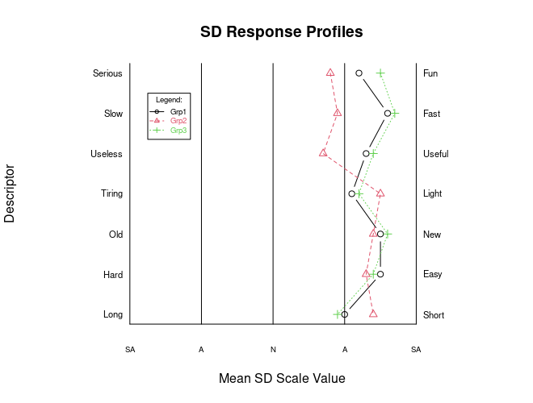

## sdRgraph
`sdRgraph` is an [**R**](https://svn.R-project.org/R/) package that contains an `R` function, `sdRplot`, that can be used for creating ***semantic differential*** (SD) inventory plots (see [Wikipedia: Semantic differential](https://en.wikipedia.org/wiki/Semantic_differential) for more info).  

(You may have to change some of the graphing parameters in the written function, as the need arises, to get better quality plots; please see [`sdRplot`](https://github.com/justineuro/sdRgraph), a GitHub repository that contains this `R` function.)  

 sdRgraph by <a xmlns:cc="http://creativecommons.org/ns#" href="https://github.com/justineuro/" property="cc:attributionName" rel="cc:attributionURL">Justine Leon A. Uro</a> is licensed under a <a rel="license" href="http://creativecommons.org/licenses/by/4.0/">Creative Commons Attribution 4.0 International License</a>. Based on a work at <a xmlns:dct="http://purl.org/dc/terms/" href="https://github.com/justineuro/sdRgraph" rel="dct:source">https://github.com/justineuro/sdRgraph</a>.
